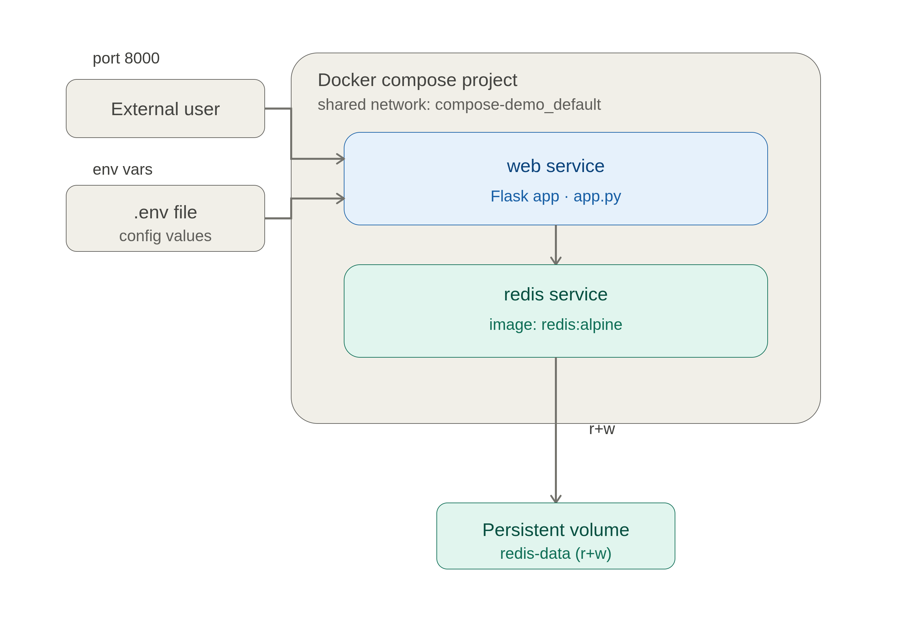

# Compose Demo — What I Learned

A tiny Flask + Redis app I built to practice Docker Compose. Notes on the
concepts I picked up while making it.

## The setup

A Flask web service that increments a hit counter stored in Redis. Two
services, wired together with Compose.



## What I learned

### 1. Splitting Compose files with `include`
You can keep infrastructure separate from your app. Here `redis` lives in
[infra.yaml](infra.yaml) and gets pulled into [compose.yaml](compose.yaml):

```yaml
include:
  - path: ./infra.yaml
```

### 2. Environment variables from `.env`
Compose automatically reads a `.env` file, so I can use `${APP_PORT}` in the
YAML instead of hardcoding values.

```yaml
ports:
  - "${APP_PORT}:5000"
```

### 3. Service discovery by name
Containers reach each other using the **service name** as hostname. The app
connects to `redis:6379` — no IP addresses needed, Compose's internal DNS
handles it.

### 4. Health checks + `depends_on`
`depends_on` alone only waits for a container to *start*, not to be *ready*.
Adding a `healthcheck` and `condition: service_healthy` makes the web service
wait until Redis actually answers `PING`:

```yaml
depends_on:
  redis:
    condition: service_healthy
```

### 5. Persisting data with volumes
A named volume keeps Redis data alive across restarts:

```yaml
volumes:
  - redis-data:/data
```

### 6. Hot reload with `docker compose watch`
The `develop.watch` block reloads code without rebuilding every time:
- editing source files → `sync + restart`
- editing `requirements.txt` → `rebuild`

```bash
docker compose watch
```

## Run it

```bash
docker compose up --build      # start
# open http://localhost:8000
docker compose down -v         # stop + wipe redis volume
```
